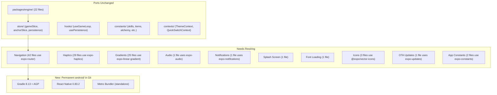
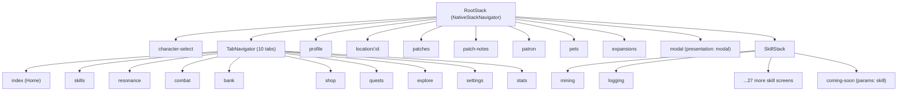

# Arteria-Gradle-Edition: Expo Removal Migration Plan

## Architecture Overview

The existing codebase has a clean separation that makes this migration viable:

## Phase 0: Project Scaffold

Create `C:\Users\home\Desktop\AI\ANDROID\Arteria-Gradle-Edition\` as a fresh bare React Native 0.83 project.

- Run `npx @react-native-community/cli init ArteriaGradle --version 0.83.2`
- Verify Gradle 8.13 in `android/gradle/wrapper/gradle-wrapper.properties`
- Verify the project opens in Android Studio with a working `app` run configuration
- Set up the monorepo structure: `packages/engine/` and `apps/mobile/`
- Copy `packages/engine/` verbatim (zero changes needed -- it is pure TypeScript)
- Configure Metro to resolve the monorepo workspace (`watchFolders`, `nodeModulesPaths`)

**Key files to create/configure:**

- `package.json` (root workspace)
- `apps/mobile/package.json` (stripped of all `expo-`* deps)
- `apps/mobile/metro.config.js` (bare RN metro config, not Expo's)
- `apps/mobile/babel.config.js` (keep `react-native-reanimated/plugin`)
- `apps/mobile/tsconfig.json` (keep path aliases like `@/`)
- `apps/mobile/android/` (committed to Git permanently)

## Phase 1: Install Bare-RN Equivalents of Expo Packages

Replace each Expo package with its community equivalent. All 15 Expo packages map to well-known alternatives:

- **expo-router** (42 files) --> `@react-navigation/native` + `@react-navigation/native-stack` + `@react-navigation/bottom-tabs` (already partially installed)
- **expo-haptics** (29 files) --> `react-native-haptic-feedback`
- **expo-linear-gradient** (25 files) --> `react-native-linear-gradient`
- **@expo/vector-icons** (3 files) --> `react-native-vector-icons` (same icon families, different import path)
- **expo-constants** (2 files) --> `react-native-device-info` or inline `BuildConfig` values
- **expo-symbols** (2 files) --> Remove (only used in iOS icon-symbol component)
- **expo-font** (1 file) --> `react-native-asset` + link fonts in `android/app/src/main/assets/fonts/`
- **expo-splash-screen** (1 file) --> `react-native-splash-screen`
- **expo-status-bar** (1 file) --> React Native's built-in `StatusBar`
- **expo-web-browser** (1 file) --> React Native's `Linking.openURL()`
- **expo-notifications** (1 file) --> `@notifee/react-native`
- **expo-updates** (1 file) --> Remove (no OTA in bare RN, or add CodePush later)
- **expo-audio** (1 file) --> `react-native-track-player` or `react-native-sound`
- **@expo-google-fonts/cinzel** (1 file) --> Bundle `.ttf` files directly in assets
- **expo-image** (0 direct imports found) --> `react-native-fast-image` or built-in `Image`

**Packages that survive unchanged** (already bare-RN compatible):

- `react-native-mmkv` (1 file), `react-native-reanimated` (8 files), `react-native-safe-area-context` (44 files), `react-native-svg` (1 file), `@react-navigation/`* (5 files), `@reduxjs/toolkit`, `react-redux`

## Phase 2: Navigation Rewrite (Biggest Task)

Replace expo-router's file-based routing with explicit React Navigation navigators. The current route tree:

**Create these files:**

- `apps/mobile/navigation/RootNavigator.tsx` -- replaces `app/_layout.tsx`
- `apps/mobile/navigation/TabNavigator.tsx` -- replaces `app/(tabs)/_layout.tsx`
- `apps/mobile/navigation/SkillNavigator.tsx` -- replaces `app/skills/_layout.tsx`
- `apps/mobile/navigation/types.ts` -- typed param lists for all routes

**Migration pattern for each screen file:**

1. Remove `import { Stack, router } from 'expo-router'`
2. Add `import { useNavigation } from '@react-navigation/native'`
3. Replace `router.push('/skills/mining')` with `navigation.navigate('Mining')`
4. Replace `router.back()` with `navigation.goBack()`
5. Replace `router.replace('/(tabs)/')` with `navigation.reset({ routes: [{ name: 'Tabs' }] })`
6. Remove per-screen `Stack.Screen` options (move to navigator definition)
7. Replace `useLocalSearchParams` with `useRoute().params`

## Phase 3: Import Swaps (Mechanical, High Volume)

Bulk find-and-replace across all screen/component files:

- `import * as Haptics from 'expo-haptics'` --> `import ReactNativeHapticFeedback from 'react-native-haptic-feedback'`
  - `Haptics.impactAsync(Haptics.ImpactFeedbackStyle.Light)` --> `ReactNativeHapticFeedback.trigger('impactLight')`
  - Affects 29 files but the pattern is identical in each
- `import { LinearGradient } from 'expo-linear-gradient'` --> `import LinearGradient from 'react-native-linear-gradient'`
  - API is identical (`colors`, `start`, `end` props). Affects 25 files, pure import swap.
- `import { Ionicons, MaterialCommunityIcons } from '@expo/vector-icons'` --> `import Ionicons from 'react-native-vector-icons/Ionicons'` etc.
  - Affects 3 files.
- `import { StatusBar } from 'expo-status-bar'` --> `import { StatusBar } from 'react-native'`
  - Affects 1 file. Prop `style="light"` becomes `barStyle="light-content"`.

## Phase 4: Native Module Replacements (Small, Targeted)

Each of these touches 1-2 files:

- **Audio** ([apps/mobile/utils/sounds.ts](apps/mobile/utils/sounds.ts)): Replace `expo-audio`'s `useAudioPlayer` with `react-native-sound` or `react-native-track-player`. Same preload + play pattern.
- **Notifications** ([apps/mobile/utils/notifications.ts](apps/mobile/utils/notifications.ts)): Replace `expo-notifications` with `@notifee/react-native`. Schedule/cancel local notification API is similar.
- **Splash Screen** ([apps/mobile/app/_layout.tsx](apps/mobile/app/_layout.tsx)): Replace `expo-splash-screen` with `react-native-splash-screen`. `preventAutoHideAsync()` becomes `SplashScreen.show()`, `hideAsync()` becomes `SplashScreen.hide()`.
- **Font Loading**: Bundle Cinzel `.ttf` files in `android/app/src/main/assets/fonts/`. Remove `useFonts` hook; fonts are available globally.
- **OTA Updates**: Remove `expo-updates` usage from settings screen. Add a "Check for updates" stub or integrate CodePush later.

## Phase 5: Android Project Finalization

- Commit `android/` to Git (it is now permanent, not generated)
- Add `android/.gitignore` for build caches (`.gradle/`, `build/`, `.cxx/`, `local.properties`)
- Configure `android/gradle.properties` with RN settings (Hermes, New Architecture, R8 minify)
- Port the ABI splits config from `plugins/withAbiSplits.js` directly into `android/app/build.gradle`
- Port proguard rules from the Expo-generated project
- Create updated build scripts (`1_Run_Local_Android_Build.bat`, `2_Build_APK_Local.bat`) that call `gradlew` directly without `expo prebuild`
- Verify Android Studio opens `android/` with a working `app` run configuration

## Phase 6: Verification

- Build debug APK and run on device/emulator
- Verify all 10 tabs render
- Verify skill screen navigation (push, back, prev/next)
- Verify character-select flow (no manifest --> select --> tabs)
- Verify MMKV persistence (save/load/migrate)
- Verify game loop ticks and offline progression
- Verify audio, haptics, notifications
- Verify splash screen and font rendering

## Effort Estimate

| Phase                         | Files touched          | Effort                   |
| ----------------------------- | ---------------------- | ------------------------ |
| Phase 0: Scaffold             | ~10 config files       | 1-2 hours                |
| Phase 1: Install deps         | package.json only      | 30 min                   |
| Phase 2: Navigation rewrite   | ~45 files              | 4-6 hours (biggest task) |
| Phase 3: Import swaps         | ~50 files (mechanical) | 2-3 hours                |
| Phase 4: Native modules       | ~5 files               | 2-3 hours                |
| Phase 5: Android finalization | ~5 config files        | 1-2 hours                |
| Phase 6: Verification         | 0 files                | 2-3 hours                |

**Total: ~15-20 hours of focused work across multiple sessions.**

## What NOT to Change

- `packages/engine/` -- zero modifications
- Redux store structure (`gameSlice`, `anchorSlice`, `persistence.ts` API)
- MMKV save format (anchors, manifest)
- Game constants, skill data, item data
- Component visual logic (only imports change, not rendering)
- Theme system (`ThemeContext`, palettes)

