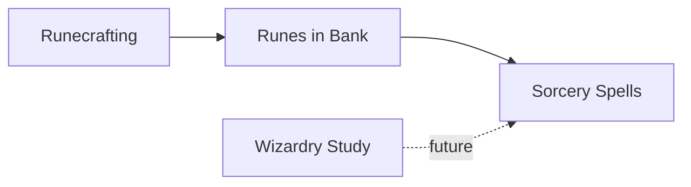

# Sorcery & Wizardry Implementation Plan

## Goal

Ship **Wizardry** (Support) and **Sorcery** (Combat/Magic) as playable skills that form the Magic Chain: Runecrafting produces runes → Wizardry studies for passives → Sorcery consumes runes to cast. Phase 1: no combat integration; spells grant XP only.

## Current Reality

- **Runecrafting** exists: 14 altars, essence → runes. Runes are in `items.ts` (air_rune, mind_rune, … void_rune).
- **Sorcery** and **Wizardry** exist in skill registry (`skills.ts`) and theme; not implemented, no screens.
- **SKILLS_ARCHITECTURE** §11–12: Sorcery = Mana + Runes → Spells; Wizardry = Study Tomes/Scrolls → Passives.
- No Mana system exists yet. Phase 1: **skip Mana**; Sorcery consumes runes only.

## Product Direction

### Wizardry (Support)
- **Core loop:** Study nodes (tick-based, like Agility). XP only, no items consumed or produced.
- **Nodes:** Basic Scroll Reading (Lv 1), Tome of the Void (Lv 25), Celestial Almanac (Lv 50).
- **Future:** Unlocks Sorcery spells, rune cost reduction, Mana Max. Phase 1 = XP loop only.

### Sorcery (Combat/Magic)
- **Core loop:** Cast spells (tick-based). Consume runes per tick; grant Sorcery XP. No Mana in Phase 1.
- **Spells:**
  - Lumina Spark (Lv 1): air_rune x1, mind_rune x1 → XP
  - Voidmire Bolt (Lv 20): chaos_rune x1, death_rune x1 → XP
  - Astral Storm (Lv 70): cosmic_rune x2, law_rune x1 → XP
- **Future:** Combat damage, Mana. Phase 1 = rune consumption + XP only.



---

## Phase 1: Define Wizardry Data

Create [apps/mobile/constants/wizardry.ts](c:/Users/home/Desktop/Arteria/apps/mobile/constants/wizardry.ts).

```ts
export interface WizardryStudy {
  id: string;
  name: string;
  levelReq: number;
  xpPerTick: number;
  baseTickMs: number;
  successRate: number;
  emoji: string;
  description: string;
}

export const WIZARDRY_STUDIES: WizardryStudy[] = [
  { id: 'basic_scroll', name: 'Basic Scroll Reading', levelReq: 1, xpPerTick: 15, baseTickMs: 4000, successRate: 1, emoji: '📜', description: '...' },
  { id: 'tome_of_void', name: 'Tome of the Void', levelReq: 25, xpPerTick: 45, baseTickMs: 5500, successRate: 0.98, emoji: '📕', description: '...' },
  { id: 'celestial_almanac', name: 'Celestial Almanac', levelReq: 50, xpPerTick: 85, baseTickMs: 7000, successRate: 0.95, emoji: '📘', description: '...' },
];
```

No items consumed or produced. Register in `ACTION_DEFS` with `items: []`, no `consumedItems`.

---

## Phase 2: Define Sorcery Data

Create [apps/mobile/constants/sorcery.ts](c:/Users/home/Desktop/Arteria/apps/mobile/constants/sorcery.ts).

```ts
export interface SorcerySpell {
  id: string;
  name: string;
  levelReq: number;
  xpPerTick: number;
  baseTickMs: number;
  successRate: number;
  consumedItems: { id: string; quantity: number }[];
  emoji: string;
  description: string;
}

export const SORCERY_SPELLS: SorcerySpell[] = [
  { id: 'lumina_spark', name: 'Lumina Spark', levelReq: 1, xpPerTick: 18, baseTickMs: 3500, successRate: 1, consumedItems: [{ id: 'air_rune', quantity: 1 }, { id: 'mind_rune', quantity: 1 }], emoji: '✨', description: '...' },
  { id: 'voidmire_bolt', name: 'Voidmire Bolt', levelReq: 20, xpPerTick: 55, baseTickMs: 5000, successRate: 0.96, consumedItems: [{ id: 'chaos_rune', quantity: 1 }, { id: 'death_rune', quantity: 1 }], emoji: '🕳️', description: '...' },
  { id: 'astral_storm', name: 'Astral Storm', levelReq: 70, xpPerTick: 120, baseTickMs: 8000, successRate: 0.9, consumedItems: [{ id: 'cosmic_rune', quantity: 2 }, { id: 'law_rune', quantity: 1 }], emoji: '☄️', description: '...' },
];
```

Register in `ACTION_DEFS` with `consumedItems`, `items: []`. Game loop already handles `consumedItems` (Runecrafting pattern); auto-stop when out of runes.

---

## Phase 3: Wire Gameplay into the Engine

Update [apps/mobile/hooks/useGameLoop.ts](c:/Users/home/Desktop/Arteria/apps/mobile/hooks/useGameLoop.ts).

- Import `WIZARDRY_STUDIES` and `SORCERY_SPELLS`.
- Register each in `ACTION_DEFS` (Wizardry: no consumedItems; Sorcery: consumedItems from spell def).
- Add mastery entries in [apps/mobile/constants/mastery.ts](c:/Users/home/Desktop/Arteria/apps/mobile/constants/mastery.ts):
  - **Wizardry:** xp_bonus, speed_bonus.
  - **Sorcery:** xp_bonus, speed_bonus, rune_saver (preserve chance).

---

## Phase 4: Build Skill Screens

Create [apps/mobile/app/skills/wizardry.tsx](c:/Users/home/Desktop/Arteria/apps/mobile/app/skills/wizardry.tsx) and [apps/mobile/app/skills/sorcery.tsx](c:/Users/home/Desktop/Arteria/apps/mobile/app/skills/sorcery.tsx).

Model after [agility.tsx](c:/Users/home/Desktop/Arteria/apps/mobile/app/skills/agility.tsx):
- Header: level, XP bar, prev/next nav.
- Subtitle: discovery/academic fantasy.
- Card list: level req, XP/tick, interval, start/stop.
- **Sorcery only:** Show consumed runes per spell; affordability check (like Runecrafting essence check).

---

## Phase 5: Promote to Implemented

- [skills.ts](c:/Users/home/Desktop/Arteria/apps/mobile/constants/skills.ts): Add `wizardry` and `sorcery` to `IMPLEMENTED_SUPPORT_SKILLS` (or Combat for Sorcery per pillar).
- [skillNavigation.ts](c:/Users/home/Desktop/Arteria/apps/mobile/constants/skillNavigation.ts): Add both to nav order.
- [useIdleSoundscape.ts](c:/Users/home/Desktop/Arteria/apps/mobile/hooks/useIdleSoundscape.ts): Add `wizardry`, `sorcery`.
- [GlobalActionTicker.tsx](c:/Users/home/Desktop/Arteria/apps/mobile/components/GlobalActionTicker.tsx): Add emojis (📜, ✨ or 🪄).

---

## Phase 6: Documentation and Release

- SCRATCHPAD, SUMMARY, CHANGELOG
- SKILLS_ARCHITECTURE: Mark Wizardry/Sorcery implemented; add spec summary.
- patchHistory.ts, index.html
- ROADMAP: Mark Sorcery/Wizardry Phase 1 done.

---

## Scope Guardrails

- No Mana system in Phase 1.
- No combat integration (spells don't deal damage yet).
- No Wizardry→Sorcery unlock gates in Phase 1 (both independently trainable).
- Reuse existing skill-screen patterns (Agility/Astrology).

## Definition of Done

- Wizardry and Sorcery are tappable from Skills grid.
- Wizardry: 3 study nodes, XP only.
- Sorcery: 3 spells, consume runes, grant XP; auto-stop when out of runes.
- Docs and release surfaces updated.
