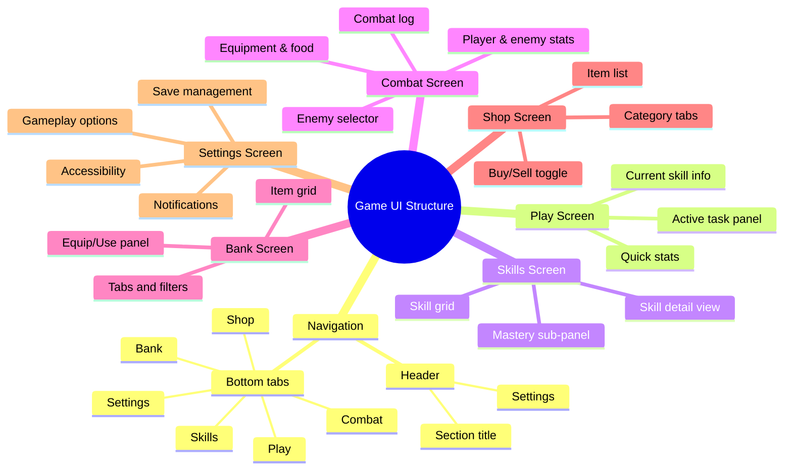

> [!WARNING]
> **ATTENTION:** Do NOT remove or delete existing texts, updates, docs, or anything else in this document. Only append, compact, or update.

Here’s a practical style guide you can hand to a designer and developer to “build and style and section out” a game like Melvor Idle, focused on UI/UX, structure, and visual style.

---

## 1. High-Level Concept & Tone

**Target experience:**
- Idle/incremental RPG with deep math, not action.
- Numbers, progress bars, and optimization are the core “gameplay”.
- UI should feel like a clean, modern desktop app more than a flashy action game.

**Visual tone:**
- “Quietly engaging”: not over-stimulating, but satisfying to watch fill up.
- Dark mode by default (Melvor has a dark theme with option for light).【turn0search1】
- Pixel-art or semi-pixel art is common in this space (Melvor uses simple pixel-style sprites).【turn0search6】

---

## 2. App Structure & Navigation

### 2.1 Main Sections (Top-Level)

Use a small, consistent set of top-level sections. For a Melvor-like idle RPG:

- **Play / Adventure**  
  Entry point for skilling and combat. Where you “do” things.
- **Skills**  
  Overview of all skills, their levels, XP bars, and quick actions.
- **Combat**  
  Enemy selection, current fight, and combat stats.
- **Bank / Inventory**  
  All items, equipment, and resource management.【turn0search3】
- **Shop / Market**  
  Buy/sell items and gear.
- **Progression / Mastery**  
  Long-term mastery systems, unlocks, and achievements.
- **Settings**  
  Options, notifications, save management, etc.【turn0search1】

On **mobile**, show this as:
- Bottom tab bar (5–6 items max), or
- Hamburger menu on very small screens.

On **desktop/web**, a left sidebar is fine.

---

### 2.2 Navigation Pattern

**Recommended pattern:**

- Persistent header (top) with:
  - Hamburger or back button on the left.
  - Current section title in the center.
  - Settings/notification icon on the right.
- Persistent bottom nav on mobile; top nav on desktop.

**Behavior:**
- Nav items are always visible; no deep nesting that hides sections.
- Opening a section replaces the main content area; nav stays put.

---

## 3. Layout Grid & Spacing

Use a simple, consistent grid:

- **Columns:**
  - Mobile: 4 columns.
  - Tablet: 8 columns.
  - Desktop: 12 columns.
- **Margins:**
  - Mobile: 16px.
  - Tablet: 24px.
  - Desktop: 32px.
- **Gutter (gap between columns):** 8–12px.

**Spacing scale (example):**
- xs: 4px
- sm: 8px
- md: 16px
- lg: 24px
- xl: 32px
- 2xl: 48px

Use these for:
- Section padding
- Card margins
- Form field spacing

---

## 4. Visual Style

### 4.1 Color Palette

Define a small palette and use it strictly:

- **Background (dark mode)**
  - App bg: `#0f111a`
  - Card bg: `#1b1e29`
- **Text**
  - Primary: `#e8e9ed`
  - Secondary: `#8b8fa3`
  - Disabled: `#5a5e6b`
- **Primary accent**
  - Main: `#4a90e2` (blue for main buttons, links)
  - Hover/Active: `#6aa3f5`
- **Positive / XP / Success**
  - Green: `#4caf50`
- **Warning / Gold**
  - Gold: `#ffca28`
- **Danger / Low HP**
  - Red: `#f44336`
- **Neutral / borders**
  - Border: `#2b2f3d`
  - Dividers: `#252837`

Apply:
- Background → screens
- Card → panels, modals, sections
- Accent → primary buttons, selected states
- Positive → XP gains, progress bars
- Gold → currency, important rewards

---

### 4.2 Typography

Use two font families:

- **UI font:** clean, readable sans-serif (e.g., Inter, Roboto, or similar).
- **Game font:** optional pixel/retro font for titles and labels (common in idle RPGs).【turn0search8】

**Type scale (example):**

- `xs`: 10–11px – tooltips, tiny labels.
- `sm`: 12–13px – secondary text.
- `base`: 14–16px – body copy.
- `lg`: 18–20px – section titles.
- `xl`: 22–24px – screen titles.
- `2xl`: 28–32px – big numbers (HP, XP, level).

Guidelines:
- Use **bold only for labels and headers**; avoid bold body copy.
- Avoid all-caps except for small labels (e.g., “XP”, “HP”).
- Ensure contrast meets WCAG AA (minimum 4.5:1 for normal text).

---

### 4.3 Iconography

- Simple, line-based icons for UI actions (settings, nav, etc.).
- Pixel-art or semi-pixel icons for items and skills, consistent with Melvor’s style.【turn0search6】
- Use a consistent stroke width (e.g., 2px).
- Provide two sizes:
  - 24px – inline with text.
  - 32–40px – large icon in lists or cards.

---

## 5. Component Library

### 5.1 Progress Bars

Progress bars are central to idle games. They should be:

- Horizontal.
- Filled from left to right.
- With a clear fill color and background.

**States:**
- Inactive: background color.
- Active: fill animates smoothly.
- Paused: dimmer fill.
- Complete: full bar with “completed” label or icon.

**Structure:**
- Label on the left (e.g., “XP to Level”).
- Current/Total on the right (e.g., “83 / 100”).
- Optional percentage below the bar.

---

### 5.2 Buttons

Define 3–4 button styles:

- **Primary** – main actions (Start Task, Equip)
  - Background: primary accent.
  - Text: white.
- **Secondary** – alternative actions (Sell, Cancel)
  - Background: card or border color.
  - Text: secondary text.
- **Text / Ghost** – low emphasis (links, small actions)
  - Background: transparent.
  - Text: primary accent.
- **Disabled**
  - Background: neutral dark.
  - Text: disabled text.

---

### 5.3 Cards / Panels

Use cards to group related data:

- Card header:
  - Title (bold, larger text).
  - Optional icon.
- Card body:
  - Key values (HP, XP, level).
  - Progress bars.
- Card footer:
  - Actions (Start, Pause, Equip).

Example: a **Skill Card**:
- Header: skill name + icon.
- Body: level, XP bar, mastery progress.
- Footer: “Train” button.

---

### 5.4 Lists & Tables

- Use simple two-line list items:
  - Title: item name.
  - Subtitle: quantity, level, or requirement.
- For complex data, use table-like layouts:
  - Column headers: “Item”, “Quantity”, “Action”.
  - Right-aligned numeric values.

---

### 5.5 Modals & Dialogs

- Use modals for:
  - Confirmation dialogs (e.g., “Abandon task?”).
  - Detailed item tooltips.
- Structure:
  - Header: title.
  - Body: content and inputs.
  - Footer: action buttons.

---

## 6. Screen-by-Screen Layout Patterns

Below is a structural view of how to section out the main screens.

### 6.1 Skills Screen

**Layout:**
- Left: list of skills (vertical or grid).
- Right (on wider screens): detail panel for selected skill.

**Skill List Item:**
- Icon.
- Name + level.
- XP progress bar.
- Optional “Train” button.

**Skill Detail Panel:**
- Large title and icon.
- Current level & XP.
- Progress bar to next level.
- Actions: “Train”, “Pause”, “Set task”.
- Mastery sub-section: list of items or activities with mastery progress.

---

### 6.2 Combat Screen

**Layout:**
- Top: enemy selector (list or dropdown).
- Middle: combat log (scrollable text).
- Bottom: player and enemy stats.

**Combat Stats Panel:**
- Two columns:
  - Player: HP, Attack, Strength, Defense.
  - Enemy: HP, Attack, Defense.
- Progress bars for HP.
- Auto-attack indicator and estimated time to kill.

**Enemy List:**
- Table or list with:
  - Name.
  - Combat level.
  - HP.
  - Difficulty indicator.
- Highlight the currently selected enemy.

---

### 6.3 Bank / Inventory Screen

Melvor’s bank is central; players spend a lot of time here.【turn0search3】

**Layout:**
- Top: tabs (All, Equipment, Resources, Food, etc.).
- Middle: item grid.
- Bottom (or right): item detail/equip panel.

**Item Grid:**
- Fixed-size cells.
- Each cell:
  - Item icon.
  - Quantity (small number in corner).
- Support for:
  - Tap to view details.
  - Long-press to quick-action.

**Item Detail Panel:**
- Name and icon.
- Description.
- Stats (if equipment).
- Actions: Equip, Use, Drop, Sell.

---

### 6.4 Shop Screen

**Layout:**
- Top: toggle (Buy / Sell).
- Below: category tabs (General, Equipment, Resources).
- Main area: item list with price and buy/sell buttons.

**Item Row:**
- Icon and name.
- Price.
- Quantity selector (if buying multiples).
- Buy/Sell button.

---

### 6.5 Settings Screen

Sections:

- **Gameplay:**
  - Auto-save frequency.
  - Offline progression settings.
  - Confirmation toggles (e.g., confirm before abandoning tasks).
- **Notifications:**
  - Notify on level-up.
  - Notify on task complete.
- **Save Management:**
  - Save, load, cloud sync.
- **Accessibility:**
  - Font size options.
  - High contrast mode.
  - Reduce motion (for animations).

---

## 7. Interaction & Feedback Patterns

### 7.1 Idle-Specific Feedback

- Always show:
  - Current task (e.g., “Mining Copper”).
  - Time remaining or progress.
  - Estimated rewards.
- Use progress bars for:
  - XP to next level.
  - Task completion.
  - Cooldowns.

### 7.2 Buttons & Actions

- For long actions:
  - “Start” / “Stop” button.
  - Clear visual state when active (e.g., filled border, different color).
- Provide immediate feedback:
  - On button press: dim for 50–100ms or animate scale.
  - On success: show small toast notification.

### 7.3 Notifications & Toasts

- Use toast messages for:
  - Level-ups.
  - Item drops.
  - Task completions.
- Keep them short and non-intrusive:
  - Auto-dismiss after 3–4 seconds.
  - Position at the bottom of the screen, above the nav bar.

---

## 8. Responsive Behavior

**Mobile:**
- Single-column layout.
- Bottom nav.
- Minimize horizontal scrolling; prefer vertical scrolling lists.

**Tablet:**
- Two-column layouts where appropriate (e.g., list on left, detail on right).
- Maintain same nav and component patterns.

**Desktop:**
- Left sidebar for nav.
- Wider content area for multi-column layouts.
- Support keyboard shortcuts (e.g., Esc to close modals).

---

## 9. Theming & Dark Mode

- Dark mode is the default for idle RPGs; Melvor provides a dark theme with a light option.【turn0search1】
- Use CSS variables or a theming system so you can later add:
  - Light theme.
  - Alternate color themes (e.g., “forest”, “arcane”).

Define tokens:
- `--bg-app`
- `--bg-card`
- `--text-primary`
- `--text-secondary`
- `--accent-primary`
- `--border-color`

---

## 10. Accessibility & Readability

- Ensure:
  - Text is resizable.
  - Touch targets are at least 44×44px on mobile.
  - Color is not the only indicator (use icons + labels).
  - Animations can be disabled.
- Provide:
  - High-contrast mode.
  - Option to increase font sizes.

---

## 11. Documentation & Naming

Create a simple living style guide that includes:

- Color palette with hex values.
- Typography scale and examples.
- Button and form states.
- Common component examples (card, list item, progress bar).
- Screen layout templates for each main section.

---

If you’d like, I can turn this into a more concrete design system document (with CSS variables and example component code) tailored to your engine (Unity, Godot, or web).