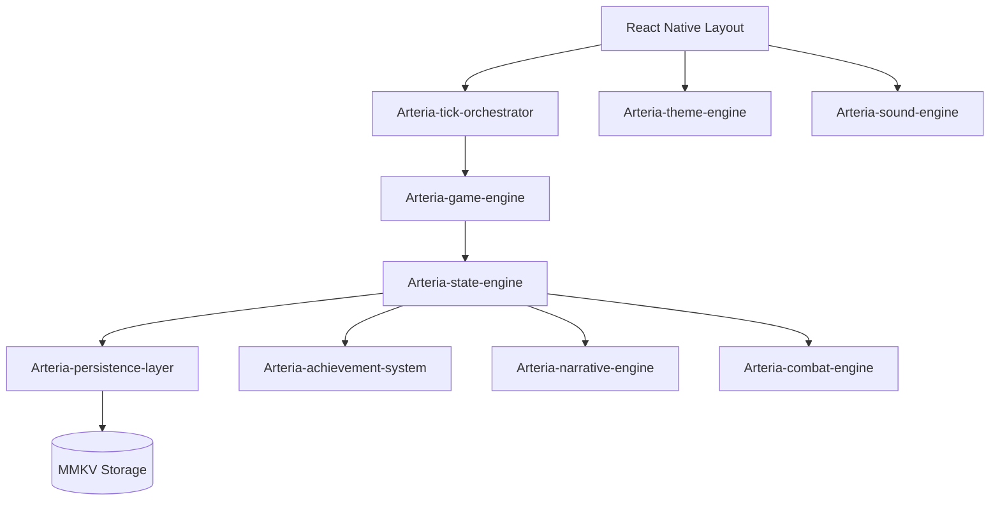

# TECHNICAL USER MANUAL

> [!IMPORTANT]
> This document provides a technical taxonomy of the Arteria Engine ecosystem. It identifies each subsystem by its official technical designation and describes its role within the sequentially evolved program stack.

## 🛠️ Engine Taxonomy

### 1. Arteria-game-engine
*   **Location:** `packages/engine` (Pure TypeScript, Zero-Dependency)
*   **Role:** The core deterministic logic layer. It manages the mathematical foundations of the game, including the `XPTable` (exponential growth curves), `TickSystem` (discrete action processing), and `PlayerState` validation. It is designed to be environment-agnostic, allowing it to run in both React Native and potential server-side environments.

### 2. Arteria-tick-orchestrator
*   **Location:** `apps/mobile/hooks/useGameLoop.ts`
*   **Role:** The bridge between real-time and game logic. It manages the high-frequency `setInterval` (100ms) that drives the active task. It handles the "delta-time" calculations, ensuring that game progress remains consistent regardless of framerate or background suspension.
*   **Offline flow:** When the app returns from background, `processDelta` builds an OfflineReport (accumulates XP, items, gold) but does *not* dispatch applyXP/addItems. The **While You Were Away** modal displays the report; on "Collect & Continue", `WhileYouWereAway` dispatches applyXP, addItems, addGold from the report. This ensures offline gains are always applied correctly.

### 2a. Arteria-offline-report (WYWA)
*   **Location:** `apps/mobile/components/WhileYouWereAway.tsx`
*   **Role:** Presents the offline gains summary (XP per skill, items, gold) and applies them on user confirmation. Receives `OfflineReport` from `useGameLoop`; on "Collect & Continue", dispatches `applyXP`, `addItems`, `addGold` to Redux before clearing the report. Ensures gains are applied only when the user explicitly acknowledges the modal.

### 3. Arteria-state-engine
*   **Location:** `apps/mobile/store/gameSlice.ts`
*   **Role:** The global state manager built on Redux Toolkit. It serves as the single source of truth for the player's progress, inventory, narrative flags, and active combat. It uses a "reactive" architecture where UI components subscribe only to relevant slices of data.

### 4. Arteria-persistence-layer
*   **Location:** `apps/mobile/store/persistence.ts`
*   **Role:** Manages high-performance synchronous state storage using **MMKV**. It handles the serialization of the `PlayerState` and manages versioned migrations to ensure save-game compatibility across sequentially evolved updates.

### 5. Arteria-theme-engine
*   **Location:** `apps/mobile/constants/theme.ts` & `apps/mobile/contexts/ThemeContext.tsx`
*   **Role:** A semantic design token system. It manages the dynamic color palettes (Dark, Light, Sepia, Midnight) and the **Glassmorphism 2.0** glass tokens. It utilizes React Context to provide real-time theme switching with no-cost re-renders through memoized style objects.
*   **Depth System:** Layered shadow and surface presets for premium visual depth:
    *   `ShadowSubtle` — barely lifted (pills, badges)
    *   `ShadowMedium` — standard float (section cards, rows)
    *   `ShadowElevated` — draws the eye (node cards, active states)
    *   `ShadowDeep` — dramatic lift (modals, featured panels)
    *   `CardStyleElevated` — elevated card with accent glow
    *   `ButtonRaisedStyle` — 3D raised button (lighter top, darker bottom)
    *   `InsetStyle` — simulated inner shadow for recessed surfaces
    *   `HeaderShadow` — downward shadow for header separation

### 6. Arteria-sound-engine
*   **Location:** `apps/mobile/utils/sounds.ts`
*   **Role:** Manages the auditory experience through `expo-audio`. It maps discrete game actions (tink, thump, splash) to spatial audio triggers and handles the "Idle Soundscapes" ambient loop persistence.

### 7. Arteria-narrative-engine
*   **Location:** `packages/engine/src/data/dialogues.ts` & `DialogueOverlay.tsx`
*   **Role:** A branching dialogue and quest state machine. It evaluates narrative requirements (flags, skills, items) to provide branching conversation paths and tracks quest progression through a multi-act structure.

### 8. Arteria-combat-engine
*   **Location:** `apps/mobile/store/gameSlice.ts` (reducers) & `combat.tsx`
*   **Role:** Manages the auto-battler math. It calculates hit chances, damage rolls, and loot tables in real-time. It features a "log-burst" system that caches combat events to prevent UI bottlenecking during high-speed encounters.

### 9. Arteria-achievement-system
*   **Location:** `apps/mobile/constants/achievements.ts`
*   **Role:** A purely reactive validation system. Instead of storing achievement states, it evaluates the existing `PlayerState` against a set of complex boolean predicates (`check` functions) to determine unlock status on-demand.

### 10. Arteria-horizon-system
*   **Location:** `apps/mobile/components/HorizonHUD.tsx`
*   **Role:** The goal-tracking and focus layer. It segments player progress into Immediate (tick-level), Session (level-level), and Grind (milestone-level) horizons, providing visual feedback through the 3-tier HUD.

### 11. Arteria-ota-pipeline
*   **Location:** `apps/mobile/app.json` & `Update_2_EAS_OTA_Update.bat`
*   **Role:** The binary-agnostic distribution system. It leverages `expo-updates` to deliver code fixes and content patches directly to players without requiring a full app-store update, managed through a strictly versioned native runtime-policy.

### 12. Arteria-skill-workbench-ui
*   **Location:** `apps/mobile/components/skill/` (SkillHeroHeader, SkillCategoryRail, RecipeWorkbenchCard, StickyTaskDock)
*   **Role:** Next-gen artisan screen paradigm (v0.6.0). Replaces the plain card-list pattern with a workbench-style layout: hero panel (active recipe, XP/hour), category rail (segmented chips), recipe workbench cards (explicit input/output slots), and sticky action dock. Woodworking is the flagship; Crafting, Firemaking, Herblore can migrate. See `DOCU/SKILLS_ARCHITECTURE.md` §0.

---

## 🔧 Technical Interaction Diagram

## 📜 Developer Mandates
1.  **Engine Isolation:** Game logic must never import from `react` or `react-native`.
2.  **State Purity:** All modifiers must pass through Redux reducers.
3.  **Persistence Safety:** Never change a type in `PlayerState` without an accompanying migration in `gameSlice.ts`.
